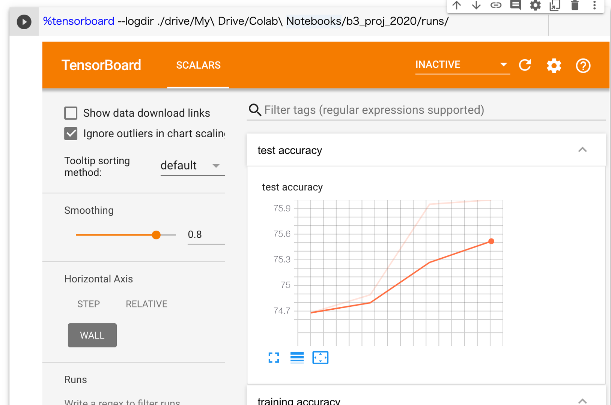

第2回: モデルの可視化
==

「2022年度 B3研究プロジェクト 〜 PyTorchによるニューラルネットワーク実装と環境構築の演習」

## 概略
今回は学習経過を可視化することで学習をより早く、効率的に行う術を身に着ける。
前回実装したVGGモデルに可視化できるコードを付け加えて実際に損失や精度の観察を行う。




## 準備
前回実装したVGGを使用してよい。
ただ、1度の学習に時間がかかるので以下にコンパクトなモデルを置いておくので、こちらを使用しても良い。
[ArtIC GitHub](https://github.com/ArtIC-TITECH/b3-proj-2022) の [`Exercise02/02_01_visualizer.ipynb`](https://github.com/ArtIC-TITECH/b3-proj-2022/blob/master/Exercise02/02_01_visualizer.ipynb)

## 公式チュートリアル
[https://pytorch.org/tutorials/intermediate/tensorboard_tutorial.html](https://pytorch.org/tutorials/intermediate/tensorboard_tutorial.html)

これに従い、説明を読んでコードのそれぞれが何をやっているのか理解しながら進めてゆく。
公式ではFashionMNISTと呼ばれるデータセットを用いているが、今回は前回のCIFAR10で置き換えたもので進める。
大きく付け加えるべきは次の2点。

### 1. writerの定義

公式チュートリアルより
```python:
from torch.utils.tensorboard import SummaryWriter

# default `log_dir` is "runs" - we'll be more specific here
writer = SummaryWriter('./drive/My Drive/Colab Notebooks/b3_proj_2022/runs/cifar10_experiment_1')
```
同じパスで記録すると、上書きではなく追記扱いになりグラフ等が見にくくなるため、必ず実行するたびに異なるパスを指定する。

### 2. 可視化する値の保存

最低限running_lossとtrain batch accとtest accuracyの3点を可視化してほしい。その他にも気になる値があれば一緒に可視化しよう。


基本的には`writer.add_xxxx('name', value, step)`という形式で追加する。
[関数一覧はこちら。](https://pytorch.org/docs/stable/tensorboard.html)
以下、公式チュートリアルよりtraining lossを保存する例。
```python:
writer.add_scalar('training loss',
                running_loss / 1000,
                epoch * len(trainloader) + i)
```
training lossと同様に、train batch accも可視化してみよう。
重みの分布を保存する場合は、以下のような関数をepochループの最後で実行すれば良い。
```python:
def add_param(writer, net, step):
    for name, value in net.named_parameters():
        writer.add_histogram(name, value, step)
```

また、実験条件等を保存する場合は、以下の例を一度実行する。
```python:
writer.add_text("batch_size_train", batch_size_train)
```

## Google Colab上でTensorboardの起動方法

[Google Colabのマニュアル](https://colab.research.google.com/github/tensorflow/tensorboard/blob/master/docs/tensorboard_in_notebooks.ipynb#scrollTo=8p3Tbx8cWEFA)より抜粋。
Tensorboardを実行するには、はじめに拡張コマンドをロードする。
```
# Load the TensorBoard notebook extension
%load_ext tensorboard
```
その後、
```
%tensorboard --logdir ./drive/My\ Drive/Colab\ Notebooks/b3_proj_2022/runs/
```
とすることでセル外にTensorBoardを表示することができる。
logdirに指定したディレクトリ以下のすべてのlogが重なって表示される。

これを学習前に実行することで学習の経過をリアルタイムで見ることができる。

## Tensorboardの便利な点
- 学習中もリアルタイムで更新してくれる。
- 開いたディレクトリより下の階層に入っているモデルが複数ある場合、比較することができる。
- 結果をcsvで吐き出すことができる。
     -  画面左上の「Show data download links」にチェックを入れるとDL可。


